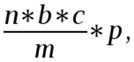
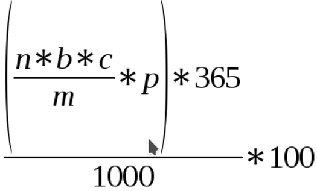

# Kreita: A New Word in Freedom of Speech. Whitepaper

**1 INTRODUCTION**

**1.1 Why blockchain?**

**1.2 Censorship as a key problem of global society**

**1.3 Decentralized Internet to make information free again**

**1.4 The idea of Kreita in a nutshell**

**2 TECHNOLOGY**

**2.1 Specification at a glance**

**2.2 Proof-of-Stake 3.0 as a core principle for Kreita operation**

**2.3 Masternodes**

**2.4 Reward Distribution Table**

**2.5 Instant transactions**

**3 EXPEDIENCY OF INVESTMENT**
**4. Future work**

**4.1 Decentralized DNS**

**4.2 Decentralized Applications**

**5 CONCLUSION**

**1 INTRODUCTION**

**1.1 Why Blockchain?**

A blockchain is a brand-new paradigm allowing people to organize and scale activities of almost any kind much more effectively compared to other existing traditional concepts. It can provide an automated distribution of any resources, both tangible – stock, bonds, cash – and intangible – patents, franchises, trademarks, goodwill, copyrights. Blockchains facilitate the coordination of all types of human interaction and will soon take the human-machine relationship to the next level.

We can assume that almost any kind of human activity can be coordinated by a blockchain (to some extent at least), as it is more effective from the functional, practical, and quantitative points of view. With consensus as a key aspect, blockchains provide more freedom, equality, and involvement than any existing system.

Summing up, we can confidently state that the choice of a blockchain as a core of the Kreita platform is justified as it is a ready-made solution with plenty of quantitative and qualitative advantages correlating with the values of our platform:

-   Decentralization.

-   Transparency.

-   No intermediaries.

-   Fast transactions.

-   Low fees.

These points call us to question the strengths and impregnability of such traditional concepts as cash, economy, trust, value, exchange – at least in the form they prevail today.

**1.2 Censorship as a Key Problem of Global Society**

The decentralized nature of blockchain allows global society to circumvent the constraints imposed by geographical jurisdictions and resolves the issue of freedom of speech in a way unavailable to the state and international organizations that protect human rights.

The ever-changing, globalized society of the XXI century suffers from the lack of freedom of speech, which (although recognized in the international human rights law) is not respected due to the constant involvement of interested parties.

Censorship deprives us of knowledge and does not allow to flourish as a global, limitless society. And this goes far beyond TV, newspapers, and radio broadcasting. News dramatically impacts global society, forming both the mood of the masses and the daily decisions we take.

The Internet may seem to be a safe haven for those seeking unbiased information and exposure, but the truth is that its centralized structure has made it an ideal tool for censorship and espionage, allowing powers that be to edit and delete information for their benefit.

-   Take, for example, Wikipedia – a global project that falls under the jurisdiction of local authorities – or the case of WikiLeaks and Edward Snowden: albeit some individuals tried to support WikiLeaks financially, PayPal had to refuse to accept these payments due to the pressure from above.

The majority of global organizations, let alone individuals, are subjected to censorship from local authorities, which always threats their work and sometimes even life, as well as it threats their relatives and social circle.

On the other hand, a blockchain is an instrument that may transform the Internet by making it unbiased, limitless and accessible to everyone. Being decentralized, it doesn’t grant power depending on wealth or social status. Instead, it distributes power proportionally to all participants, thereby creating a balance of opinions and views.

**1.3 Decentralized Internet to Make Information Free Again**

Everyone knows that the Internet is a global system of networks interlinked worldwide, but very few are aware of its original purpose. Intended to be a network in which everyone can make an equal contribution and serve the good, the Internet has changed into a global source of information managed by million-dollar corporations and businesses. These entities control access to the most important and confidential data so that each and everyone is deprived of true privacy and can be easily tracked.

Plenty of companies provide high-quality services, but that’s still far from what we expected to see back in the day. Since 2012, Google has invested over $1.2 billion in about 140 projects. At the same time, it hasn’t yet expressed a desire to add a blockchain to its search functionality (even though Google is now working on its own blockchain-related technology, its privacy and decentralization should be questioned). More than 80% of searches from PCs and 5% from mobile phones are executed in Google, but that’s not too good that such a huge power is concentrated in a single corporation.

The Web 3.0 and the Kreita project particularly is intended to build a decentralized network independent from authorities or any pressure from above. Such a network would be much more secure and effective compared to the biased informational space of today.

The crash of the dot-com bubble made people realize that the easiest way to create value based on this neutral structure was to develop centralized services to collect information and limit its accessibility solely for the purpose of subsequent monetization. By using that tactic, leading social networks like Facebook, search engines like Google, and chat apps like WhatsApp managed to grow into billion-dollar companies. However, none of them provide truly decentralized and unbiased information and freedom of speech.

The concept of the decentralized Internet implies that all basic services (responsible for publication, communication, social interaction, search for data, etc.) are provided by members of the global community on a decentralized basis. Obviously, the work of a big service can’t be blindly entrusted to one company, no matter the power it has. Instead, we need a distribution either between a multitude of cooperating servers or client applications within a decentralized peer-to-peer network.

**1.4 The Idea of Kreita in a Nutshell**

The Kreita platform provides an equal chance to reach to unbiased, uncensored, non-manipulative information sources, as well as express one’s honest opinion in a completely riskless way.

Unfortunately, an average person does not care too much about the security of data, let alone he or she can’t guarantee it. But we do believe that Kreita will change the current situation by bringing informational freedom and security to a completely new level.

The new generation trusts neither governments nor any kind of centralizes organization, and this fact itself makes the existence of Kreita vital and justified. Countries of the Third World have already reached the point of zero trust, which seems to be also the point of no return for the traditional centralized model. This disgusting, global breach of confidentiality worries people from all over the world, and many of them will find the Kreita platform as a solution.

The Kreita project key benefits are:

-   Privacy. The biggest issue is that we use providers that have long crossed all the legislation borders. In a decentralized model, data is distributed throughout the network rather than controlled by a single entity, which significantly increases the level of privacy. Any private information is accessible only in compliance with controlling algorithms. No one manages the network and has enough power to get access to your personal data.

-   Security. In a world of ever-growing security threats, the more data is stored in a centralized environment, the more attractive it becomes for potential intruders. Publicly controlled, decentralized environments are safer and able to resists hacking attempts and takeovers by third-parties, as well as less inclined to bankruptcy and other threats.

-   Data portability. In a decentralized network, people manage their information. They can choose who they want to share information with and retain control over information even when they refuse the services of a particular provider.

Conceived as a decentralized system, web-space has gradually transformed into big servers that control personal data. Kreita is about to bring the original idea of the free Internet back to life. We’re going to endow people with the power to control and dispose of their data as they please. It’s time to change restrictions and pressure to an easy and round-the-clock access to information and data!

**2 TECHNOLOGY**

**2.1 Specification at a Glance**

| Specification                                      | Description                          |
|----------------------------------------------------|--------------------------------------|
| Cryptocurrency title                               | Kreita                               |
| Ticker                                             | KRT                                  |
| Type                                               | PoS                                  |
| Algorithm                                          | NIST5                                |
| Block time                                         | 45 sec                               |
| Reward per block                                   | Floating in the limits of 50–300 KRT |
| Transaction confirmations needed                   | 6                                    |
| Coins to set a masternode                          | 10 000 KRT                           |
| Block reward distribution (Masternodes/Stakers), % | Depends on the block                 |
| Min PoS Age                                        | 60 min                               |
| P2P port                                           | 47047                                |
| RPC port                                           | 47042                                |

**2.2 Proof-of-Stake 3.0 as a Core Principle for Kreita Operation**

First used back in 2011, the Proof of Stake concept is proved to be one of the most reliable and fair distribution models. It’s capable of maintaining the stability of the system and rewards network members depending on the number of coins they possess.

Compared to PoW, PoS reduces electricity costs. In PoW model, each further block requires more resources, while the PoS model uses as much electricity as needed to run a PC (as online presence required). Also, a potential attack on the PoS network would require an attacker to possess the lion’s share of coins and therefore would be financially unjustified. In other words, an attacker would lose more than earn.

The PoS 3.0 suggests users keeping their wallets open to get paid for confirming transactions, while the actual profitability depends on the number of coins and is slightly reduced over time until getting fixed at 25 (which is 50% of the total block reward) at the 201601 block.

**2.3 Masternodes**

Any decentralized network consists of nodes, but there are also masternodes, which

1.  ensure the privacy of transactions;

2.  increase speed of transaction;

3.  allow users to earn more compared to simple staking.

By collateralizing 10 000 Kreita coins, you can set up a masternode and be able to earn more. The percentage depends on the current block number and is floating until the 201601 block goes on.

A standard-day payment is as follows:

where:

*n* is the number of masternodes;

*b* is the number of blocks per day;

*c* is the current reward per block;

*m* is the total number of masternodes;

*p* is the average masternode payment.

ROI (Return on Investment) for running a masternode can be calculated as:

with the same variables.

**2.4 Reward Distribution Table**

|        **Blocks**         |  **Masternodes** |  **Stakers** |  **Block Reward** |
|---------------------------|:----------------:|:------------:|:-----------------:|
| 2-3840                    | 0.6              | 0.4          | 1.0               |
| 3841-5760                 | 90               | 60           | 150               |
| 5761-13440                | 115              | 60           | 175               |
| 13441-17280               | 140              | 60           | 200               |
| 17281-21120               | 170              | 55           | 225               |
| 21121-24960               | 200              | 50           | 250               |
| 24961-28800               | 235              | 40           | 275               |
| 28801-86400               | 270              | 30           | 300               |
| 86401-115200              | 200              | 50           | 250               |
| 115201-144000             | 140              | 60           | 200               |
| 144001-172800             | 90               | 60           | 150               |
| 172801-201600             | 50               | 50           | 100               |
| &gt;201601                | 25               | 25           | 50                |

**2.5 Instant Transactions**

The swiftness of transactions is one of the top priorities for most users, as it allows the system to work at a competitive speed. The SwiftTX concept ensures near-instant coin transfers and operates as follows:

-   Any transactions entering the Kreita network is checked by masternodes and included into the next block right after the consensus is achieved. This procedure greatly boosts the transaction speed, allowing users to make several transactions before the block is launched to the network.

**3 EXPEDIENCY OF INVESTMENT**

Sadly enough, the current internet infrastructure is largely centralized, and therefore no one can be sure that his or her investment is safe and not affected by third-parties. The degree of risk is too high, so more and more people refuse using centrally controlled platforms in favor of those built on open-source, decentralized blockchain-based protocols.

Although centralized products may not be scams and may have value, the idea at heart of them is opposite to the original philosophy of blockchain. In this regard, investing in decentralized projects (and Kreita in particular) seems to be promising and potentially profitable. Finally, why to stand still if there’s a chance to invest in future and thereby create it in a better way?

The decentralized Internet is obviously the best solution to return the power back to the global community rather than its most influential members. Monopoly not only decreases the level of transparency and imposes its rules but also appoints the price of the asset, which is unacceptable for both investors and traders.

The demand for Kreita coins will increase along with adoption and thereby reward early adopters and supporters. More and more people will use staking and masternodes to make passive income and access the decentralized Internet.

Any decentralized model, whether it’s commercial or purely informational, is advantageous compared to its centralized counterparts where most profits are distributed among owners and high-level directors. The Kreita project is a great investment as basing on staking nodes and masternodes, it distributes power and abilities among members depending on their contribution to the network. The mutually beneficial collaboration between developers and investors is a solid foundation for the smooth and long-term development of the Kreita platform.

**4 FUTURE WORK**

**4.1 Decentralized DNS**

The issue with traditional DNS is that authorities control the top-level domain (for example, .com) and can intercept and redirect URLs. Alas, this applies to all top-level domains (for instance, China controls all .xn domains).

At the same time, decentralized DNS allows one to create independent top-level domains, meaning it allows anyone threatened by the pressure of local authorities and censorship to freely publish information on the network.

Decentralized DNS based on Kreita coins is one of the possible future innovations. According to the idea, alternative domains registered in this system will be available as long as there are volunteers running the decentralized DNS server software, while authorities won’t be able to control the top-level domains deployed in peer-to-peer networks.

**4.2 Decentralized Applications**

Another possible progressive step is decentralized applications.

While centralized apps occupy the lion’s share of the market, they store users’ data in central locations and can be relatively easily attacked by hackers and criminals willing to get money and/or private information. That’s why dApps grow so fast. Although they’ve just started to get coverage and spread, we do believe that dApps will soon be used more widely than any of the today’s leading apps for a plenty of reasons:

-   Transparency.

-   Flexibility.

-   Decentralized nature.

-   Incentivized structure.

In contrast to centralized systems, where the information flow is controlled by a single center, decentralized apps are run by multiple nodes, while none of them instructs/governs any other node.

One of the key strategic points under consideration is the development of a convenient and user-friendly decentralized application to access the free Internet. The underlying principles are:

1.  Open source. Although an open-sourced product is easy to fork, we will do our best to provide users with the best possible experience. We expect that the open-source nature of Kreita will grow confidence in users and potential investors.

2.  Coins at the core. The coin-based concept would make Kreita dApps attractive to both users of free Internet and investors. DApp coins may be used to get access to the network and even some special treatment.

3.  Decentralization. In contrast to centralized applications, dApps can’t be shut down, as there’s no single server. All the data is decentralized, all the nodes are independent, and therefore even if one or a few of them fail, others continue to run the network without any inconvenience to users.

A decentralized app allowing users to get instant access to the Internet 3.0 is under consideration. It would help users to keep their personal data safe and make tangible profits on the go. Staking and masternodes would encourage people to hold their coins, which would in turn push KRT coins towards new ATHs.

**5 CONCLUSION**

The Kreita platform is a brand-new solution to the eternal problem of censorship and suppression. Basing on the NIST5 algorithm and with PoS and masternodes in its core, Kreita is expected to be stable, customer-oriented and quite beneficial for both investors and users.

We are here to reshape freedom of speech!
